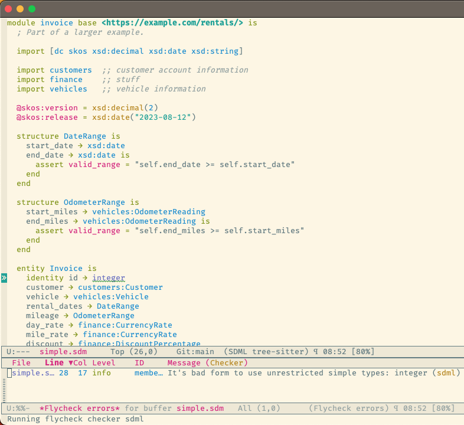

# SDML Mode for Emacs


This package provides an Emacs tree-sitter based major mode for SDML - the
[Simple Domain Modeling Language](https://github.com/sdm-lang/tree-sitter-sdml).

[](https://melpa.org/#/sdml-mode)

## Installing

Install is easiest from MELPA, here's how with `use-package`.

```elisp
(use-package sdml-mode)
```

Or, interactively.

    M-x package-install RET sdml-mode RET

### Install manually

First clone the Git repository to a local path.

```bash
git clone https://github.com/sdm-lang/emacs-sdml-mode.git
```

The following uses `use-package` but any equivalent package manager should work.
The function `sdml-mode-setup` ensures the installation of the SDML parser with
the core `tree-sitter` package.

```elisp
(use-package sdml-mode
  :load-path "/path/to/repo")
```

### Tree-Sitter Parser

Additionally you will need to manually install the parser at this time. Start by
cloning the repository.

```bash
git clone https://github.com/sdm-lang/tree-sitter-sdml.git
```

Build just the parser dynamic library, but importantly you need to select a
specific ABI version.

```bash
TS_GENERATE_ABI=13 make build_parser
```

Finally copy the dynamic library to a location in the path specified by the
Emacs variable `tree-sitter-load-path`.

```bash
cp build/libtree-sitter-sdml.dylib ~/.tree-sitter/bin/sdml.dylib
```

## Usage

Once installed the major mode should be used for any file ending in `.sdm` or
`.sdml` with highlighting and indentation support.

### Highlighting

Syntax highlighting is provided by the `tree-sitter-hl-mode` minor mode based on
the configuration in the constant `sdml-mode-tree-sitter-hl-patterns`.

The `sdml-mode` also adds to the `prettify-symbols-alist` list, the set of symbols
is in the custom variable `sdml-prettify-symbols-alist`.



### Indentation

Line indentation is provided by the `tree-sitter-indent-mode` minor mode based on
the configuration in the constant `sdml-mode-folding-definitions`.

Default indentation is two spaces, although this can be overridden by the custom
variable `sdml-mode-indent-offset`.

### Abbreviations and Skeletons

This package creates a new `abbrev-table`, named `sdml-mode-abbrev-table`, which
provides a number of useful skeletons for the following. `abbrev-mode` is enabled
by `sdml-mode` and when typing one of the abbreviations below type space to
expand.

Typing `d t SPC` will prompt for a name and expand into the SDML declaration
`datatype MyName ← opaque _` where the underscore character represents the new
cursor position.

**Declarations**: `mo`=module, `dt`=datatype, `en`=enum, `ev`=event, `pr`=property,
`st`=structure, `un`=union

**Annotation Properties**: `pal`=skos:altLabel, `pdf`=skos:definition,
`ped`=skos:editorialNote, `ppl`=skos:prefLabel, `pco`=rdfs:comment

**Constraints**: `ci`=informal, `cf`=formal, `all`=universal, `any`=existential

**Datatypes**: `db`=boolean, `dd`=decimal, `df`=double, `dh`=binary, `di`=integer, `sd`=string,
`du`=unsigned

Note that for annotation properties with language string values the skeletons
will add the value of the Emacs variable `locale-language` as the language tag.

### Debugging

* `C-c C-s d` -- open the tree-sitter debug view
* `C-c C-s q` -- open the tree-sitter query builder
* `C-c C-s t` -- open a dependency tree view
* `C-c C-s v` -- run the validator in a compilation window

## Add-Ons

* [emacs-sdml-fold](https://github.com/sdm-lang/emacs-sdml-fold) provides code-folding support to collapse and expand
  definitions.
* [emacs-sdml-ispell](https://github.com/sdm-lang/emacs-sdml-ispell) provides *selective* spell checking by only checking selected
  nodes in the tree.
* [emacs-flycheck-sdml](https://github.com/sdm-lang/emacs-flycheck-sdml) provides on-the-fly linting for SDML buffers.
* [emacs-ob-sdml](https://github.com/sdm-lang/emacs-ob-sdml) provides the ability to call the SDML [command-line tool](https://github.com/sdm-lang/rust-sdml) to
  produce diagrams and more.

## Contributing

The packages in this repository should pass the standard package checks,
including:

* `byte-compile-file`
* `package-lint`
* `checkdoc`

Automated checks are done in the Github action workflow using Eldev.

## License

This package is released under the Apache License, Version 2.0. See the LICENSE
file in the repository for details.

## Changes

### Version 0.1.9

* Feature: added new `sdml-mode-ctags-mode` minor mode that provides a command to
  generate tag files using [Universal Ctags](https://ctags.io/).
* Feature: added a refresh command, bound to `g`, to the dependency tree view.
* Refactor: module `sdml-mode-cli` now more generic for other clients.
* Build: reworked the Eldev workflow for Github actions.
* Fix: regex for compilation mode, error tracking in validation command now
  working correctly.
* Fix: added guard to commands to be relevant only in `sdml-mode`.
* Fix: removed `property_def` rule from highlighting.

### Version 0.1.8

* Feature: update to latest tree-sitter grammar (0.3.2).
* Feature: no setup functions required, just `use-package` or `require`.
* Feature: highlighting and indentation implemented as minor modes.
* Feature: now available on melpa.

### Versions 0.1.0 - 0.1.7

These versions are all pre-release and do not appear in ELPA/MELPA.
